Use biomart
================
Wei-Hua Chen (CC BY-NC 4.0)
Dec 19, 2019

In this tutorial, I will walk through briefly the common usages of ENSEMBL Biomart. Biomarts at other sites can be used in similar ways.

## Task #1. Check main and mirror sites

The ENSEMBL Biomart **Asia mirror site** is available at: http://asia.ensembl.org/biomart/martview/; this is a mirror site in Asia.

By default, it always contains the latest version of Ensembl. The version increases very quickly because Ensembl updates its annotations regularly (e.g. twice a year); those who wish to access older versions can visit **Ensembl archive**: http://asia.ensembl.org/Help/ArchiveList.

## Task #2. Get relationships between protein, transcript and gene IDs in human

### 2.1. Go to biomart, select the latest version of Ensembl genes

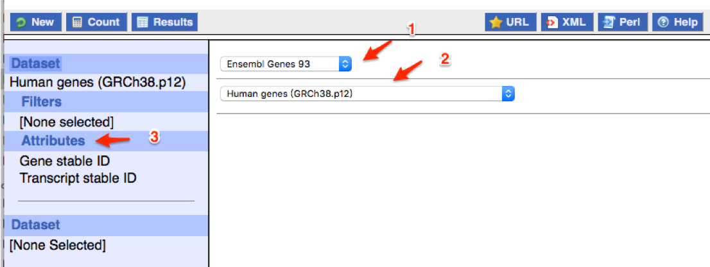

### 2.2. go to `Attributes`, `Features`, and select :

* Ensembl Gene ID,
* Transcript ID and
* Protein ID

Then click `Results` button at the top-left

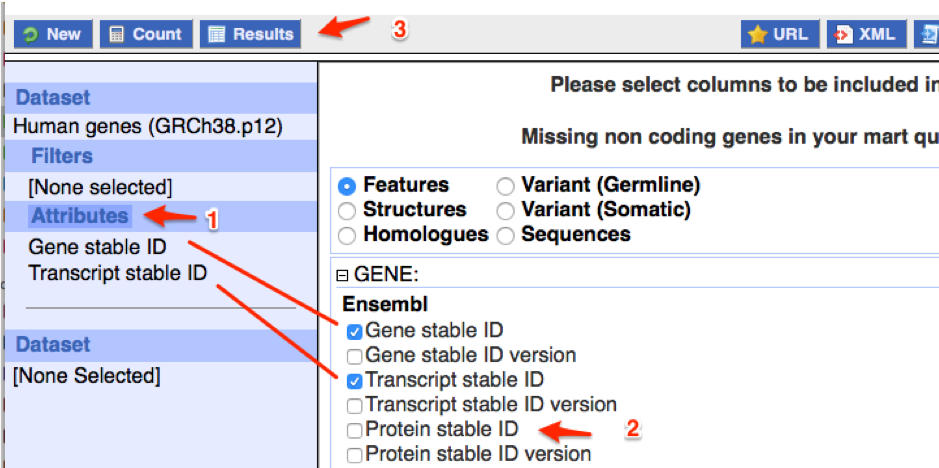

### 2.3. you will get:

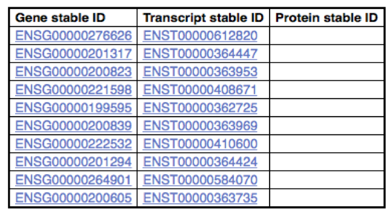

Rows with empty "Protein stable ID" are non-coding genes.

## Task #3. get GO annotations for human genes

### 3.1. go to biomart, select `Attributes`, `Features` and `EXTERNAL`

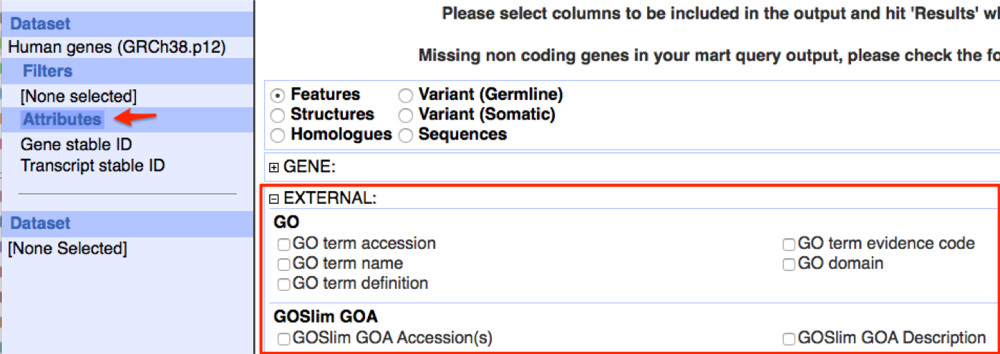

Choose `Go term accession` and `GO term name`

### 3.2. view results using the `Results` button

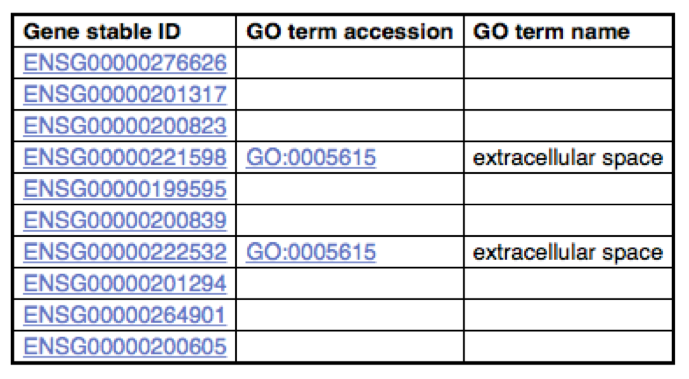

## Task #4. Get HGNC symbols for all ENSEMBL human genes

HGNC symbols are official names for human genes.

### 4.1. go to biomart, select `Attributes`, `Features` and then `Gene stable ID`

### 4.2. select `EXTERNAL` and then check the box before `HGNC symbol`

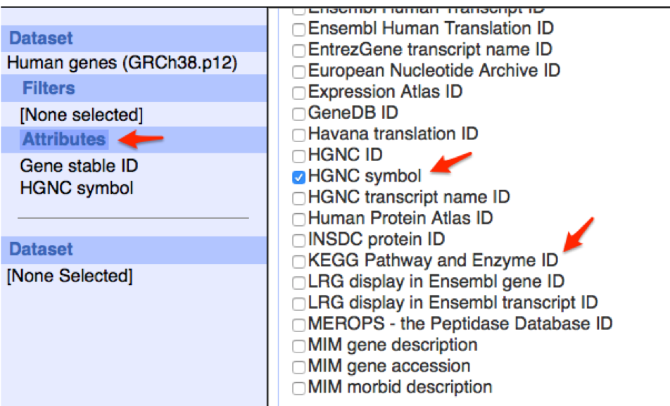

### 4.3. show the results by clicking the "Results" button

... and save the results to a local file.

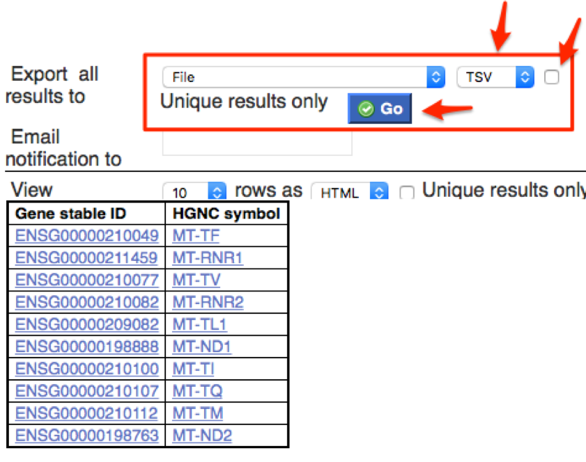

## Task #5. use filters

Find mouse genes that are:

* located on `chromosome 10`
* protein coding

and show in the final results:

* Ensembl gene ID
* chromosome ID
* MGI ID

### 5.1. go to biomart, select the following from `Attributes`, `Features`, `GENE`

* Ensembl gene ID
* chromosome ID

.. and select `MGI ID` from `EXTERNAL`

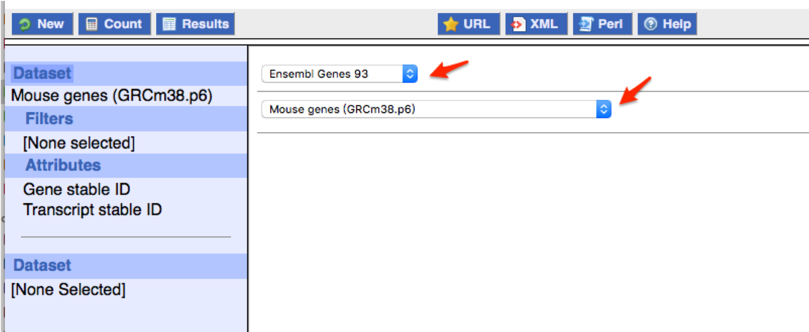

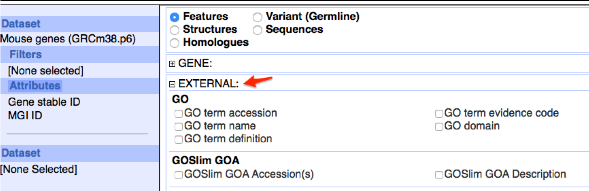

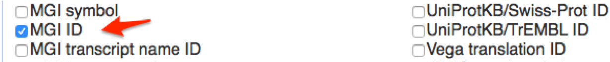

### 5.2. go to `Filters`

... and limit our selection to:
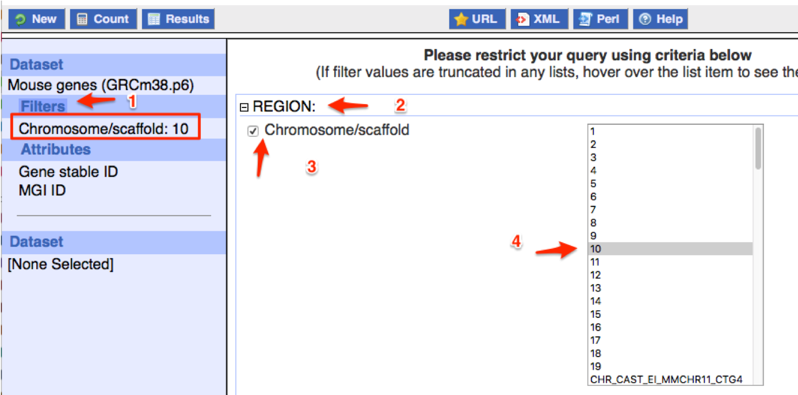
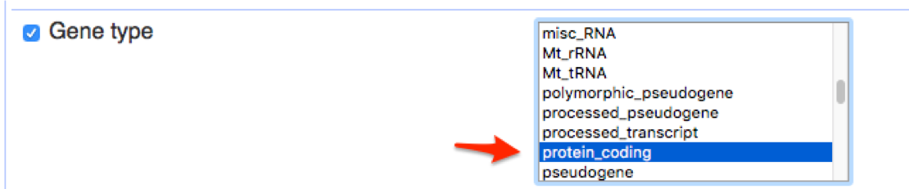

### 5.3. view the results and export to compressed file.

## Home work

1. download sequences of all human miRNAs located on chrs 1,3,7,X in fasta format.

2. get a list of gorilla protein coding genes located on chr10 and their associated GO terms.
