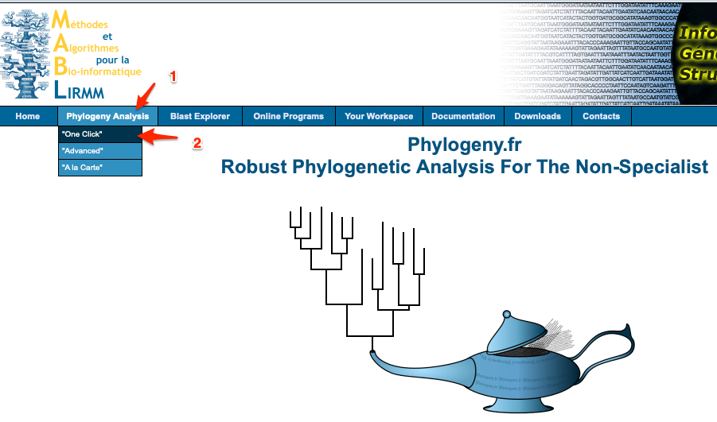

A comprehensive tutorial for phylogenetic analysis
================

## prerequisites

 - none; but knowledge about Linux-like is a plus

## purposes of this tutorial

 - to build a phylogenetic tree using SALL4 protein sequences of various species
 - to check if the SALL4 species tree is different from that of the corresponding species

## 1. get sequences ready

- first go to human SALL4 gene page at: https://www.ncbi.nlm.nih.gov/gene/57167; this page contains basic information about human SALL4 gene;

- jump to the `General protein information` by clicking the `Table of contents` sidebar on the right:

- right click and open `NP_001304960.1  sal-like protein 4 isoform 2` in a new page:

- send the protein sequence of SALL4 (isoform 2) to online `BLAST` using the link `Run BLAST` on the right:

note that the `accession id` of `SALL4` has been automatically pasted to the `Enter Query Sequence` text box:

- select the `Quick BLASTP` and click the `BLAST` button to do the blast (see the screenshot above).

- after `BLAST` is finished, choose the `Descriptions` tab (by default it is selected), and select only a few species of interest, see the screenshot below:

- click the `Download` button on the right (see screenshot above), click `FASTA(complete sequence)` to download complete protein sequences of the selected genes, and save it to `sall4.fa`.

- open the file with a text-editor such as `Atom` or `EditPlus`, change the sequence ids to the format of `<organism_name>_sall4`. See the screenshot below for examples:

## 2. use an online tool `phylogeny.fr` to do phylogenetic analysis with `one click`.

- first go to http://www.phylogeny.fr/index.cgi

- choose `Phylogeny Analysis` and then `"One click"`:

- upload the `sall4.fa` file, and click `Submit`:

- wait the analyses to finish. It may take some time. Do not refresh the page.

- the final results would look like:

## 3. the more professional way: run all analysis using `MEGA`

- first, download and install the GUI version of `MEGA7` (the latest version as of Dec 2019) from https://www.megasoftware.net.

- perform the following tasks on your own, use `sall4.fa` as your starting point; search for online courses if anything is unclear:

  - do multiple sequence alignment using `MEGA` or `MUSCLE` or any other programs that could do the job;
  - use `MEGA` to estimate the best protein evolution model for the resulting MSA;
  - use `MEGA` to build a maximum likelihood tree, do 100 bootstrap;
  - visualize the final tree, and export it to PDF;
  - send the final PDF as your final exam.
